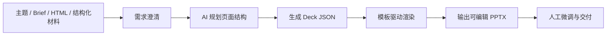
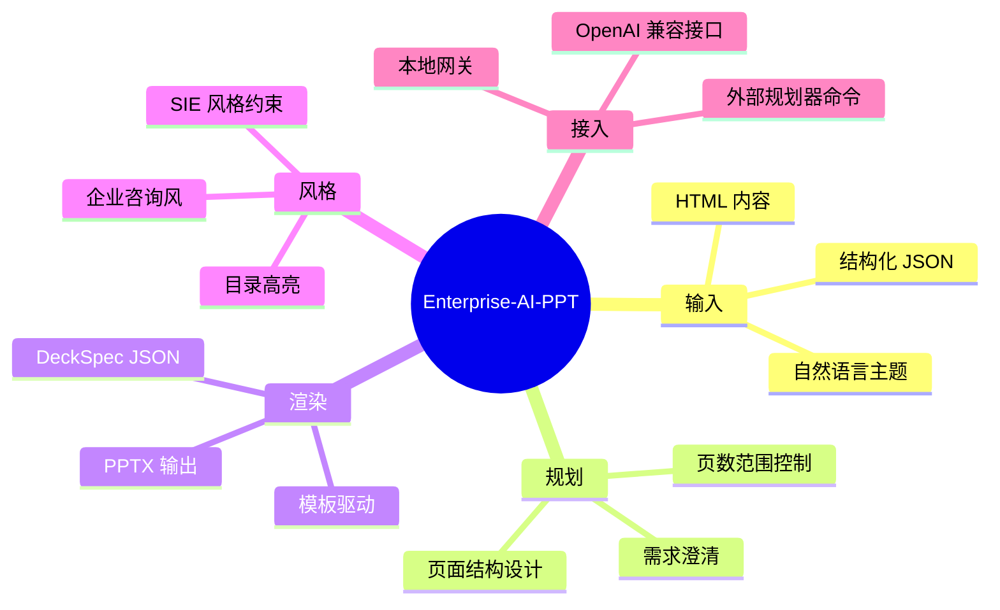

# Enterprise-AI-PPT

`Enterprise-AI-PPT` 是一个面向企业汇报场景的 AI PPT 生产项目，目标是把“主题理解、结构规划、内容组织、PPT 渲染”串成一条可复用的交付链路，并输出可继续编辑的 `.pptx` 文件。

它适合以下场景：

- 管理层汇报
- 咨询方案汇报
- 项目阶段性汇报
- 行业分析与业务研究
- 客户提案与解决方案介绍

## 项目流程图



## 核心能力图



## 管理层一页介绍

适合直接给老板或业务方快速说明项目定位：

- [项目一页介绍](./docs/PROJECT_OVERVIEW_CN.md)

## 项目价值

- 把 AI 生成能力与企业 PPT 交付流程结合起来，而不是只生成一次性内容
- 支持“先规划、后渲染”，便于审阅与修改
- 输出结果为可编辑 PPTX，方便后续继续打磨
- 可把企业模板、目录逻辑、页面风格固化成标准流程
- 支持不同模型和本地环境，便于后续接入和扩展

## 当前能力

- `Topic -> AI Outline -> Semantic Deck -> Compiled Deck -> PPTX`
- `HTML -> DeckSpec JSON -> PPTX`
- `Structure JSON -> DeckSpec JSON -> PPTX`
- 模糊需求澄清：先补齐受众、页数、风格、目标，再进入规划
- V2 语义渲染：支持 `timeline`、`stats_dashboard`、`matrix_grid`、`cards_grid` 等专用布局
- 模板驱动渲染：支持目录页高亮、正文页池、结束页保留
- 多种 LLM 接入方式：OpenAI 兼容接口、本地网关、外部规划器命令

## 推荐流程

当前推荐只把 V2 语义链路作为主流程；legacy 模板链路仅保留兼容，不再作为默认入口推广。

### 流程 A：一句话生成 PPT

适合快速生成首版汇报。

```powershell
enterprise-ai-ppt make `
  --topic "制造企业 AI 应用落地汇报" `
  --brief "面向管理层，突出当前问题、目标架构、实施路径与预期收益" `
  --min-slides 6 `
  --max-slides 10
```

### 流程 B：先规划，再渲染

适合需要先确认结构，再输出 PPT 的场景。

```powershell
enterprise-ai-ppt v2-plan `
  --topic "供应链追溯体系建设方案" `
  --brief "用于客户提案，强调监管要求、现状痛点、方案设计和实施路线" `
  --min-slides 6 `
  --max-slides 10 `
  --plan-output .\projects\generated\traceability.deck.json `
  --semantic-output .\projects\generated\traceability.semantic.json
```

```powershell
enterprise-ai-ppt v2-render `
  --deck-json .\projects\generated\traceability.deck.json `
  --ppt-output .\projects\generated\Traceability_Proposal.pptx
```

### 流程 C：从 HTML 内容生成 PPT

适合已有网页内容、导出的 HTML 页面或结构化片段。

```powershell
enterprise-ai-ppt make `
  --html .\samples\input\uat_plan_sample.html `
  --output-name Html_Render
```

### 流程 D：生成后做视觉复核

适合已经拿到 deck JSON，希望继续自动检查和迭代修正的场景。

```powershell
enterprise-ai-ppt review `
  --deck-json .\projects\generated\traceability.deck.json
```

```powershell
enterprise-ai-ppt iterate `
  --deck-json .\projects\generated\traceability.deck.json `
  --max-rounds 2
```

## 快速开始

### 1. 安装

```powershell
python -m venv .venv
.\.venv\Scripts\activate
python -m pip install --upgrade pip
python -m pip install -e .[dev]
```

安装后，推荐使用命令：

- `enterprise-ai-ppt`
- 兼容旧命令：`sie-autoppt`

如果不想安装，也可以直接运行：

```powershell
python .\main.py --help
```

### 2. 健康检查

```powershell
enterprise-ai-ppt ai-check --topic "企业 AI 汇报健康检查"
```

### 3. 生成第一个 PPT

```powershell
enterprise-ai-ppt make `
  --topic "企业数字化转型项目汇报" `
  --brief "面向管理层，输出 6 到 8 页，强调业务价值与落地路径" `
  --min-slides 6 `
  --max-slides 8
```

默认输出目录为仓库内的 `output/`。

## 常用命令

- `make`：推荐主入口；`--topic` / `--outline-json` 会走 V2 语义流程，`--html` 走 HTML 模板流程
- `review` / `iterate`：推荐的视觉复核入口，分别对应单轮与多轮复核
- `v2-plan` / `v2-render` / `v2-make`：V2 分步或全量生成流程
- `clarify`：对模糊需求先做澄清
- `ai-check`：检查 AI 规划链路是否可用
- `plan` / `render`：HTML / DeckSpec 的传统模板流程
- `ai-plan` / `ai-make` / `structure*`：保留兼容的 legacy 命令，不建议作为新流程入口

## 页数与风格策略

- 画幅默认使用 `16:9`
- 页数默认按内容密度动态推断，而不是固定写死
- 短内容通常为 `3-5` 页，中等内容 `6-10` 页，长内容 `10-20` 页
- 如果用户显式指定 `--chapters` 或 `--min-slides/--max-slides`，则以用户要求为准
- 默认风格为企业咨询风、商务克制风格
- SIE 模板下的强调色采用品牌红 `RGB(173, 5, 61)`

## 输出物

根据流程不同，项目会输出以下一种或多种产物：

- `.pptx`：最终可编辑演示文稿
- `.deck.json` / `.deck.v2.json`：中间结构化内容
- `.outline.json`：V2 大纲
- `.log.txt`：渲染日志
- 质量检查或视觉复核相关结果文件

## 项目结构

- [`main.py`](./main.py)：本地推荐入口
- [`tools/sie_autoppt`](./tools/sie_autoppt/)：核心规划与渲染代码
- [`assets/templates`](./assets/templates/)：模板与 manifest
- [`samples/input`](./samples/input/)：示例输入
- [`docs`](./docs/)：技术说明文档

## 文档入口

- [文档索引](./docs/README.md)
- [项目一页介绍](./docs/PROJECT_OVERVIEW_CN.md)
- [AI 规划说明](./docs/AI_PLANNER.md)
- [Deck JSON 规范](./docs/DECK_JSON_SPEC.md)
- [输入规范](./docs/INPUT_SPEC.md)
- [PPT 工作流](./docs/PPT_WORKFLOW.md)
- [测试说明](./docs/TESTING.md)

## 说明

当前仓库对外展示名称为 `Enterprise-AI-PPT`。  
出于兼容性考虑，内部 Python 包名和部分环境变量仍保留 `sie_autoppt` / `SIE_AUTOPPT_*` 命名。

当前源码仍位于 `tools/sie_autoppt/`，这是历史兼容结构。对外使用时请以 `enterprise-ai-ppt` 命令和 V2 语义流程为主。
