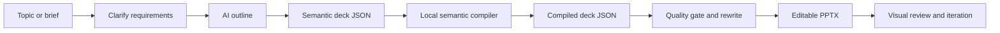
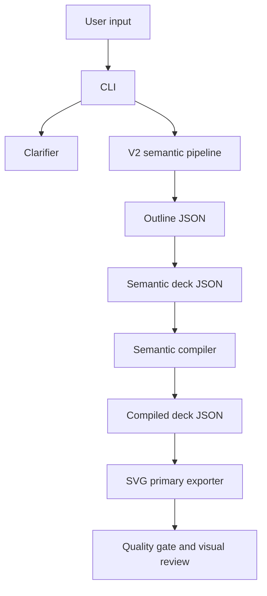
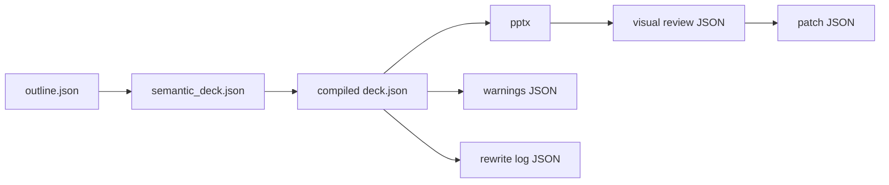

# Enterprise-AI-PPT

AI-assisted planning plus deterministic PowerPoint rendering for enterprise-grade business presentations.

- [English](#english)
- [中文](#中文)

> Diagram note: all flowcharts use default Mermaid styling without hard-coded fill colors, so they stay readable in browser light mode and dark mode.

<p align="center">
  
  
</p>

Documentation quick links:

- `docs/CLI_REFERENCE.md`
- `docs/API_REFERENCE.md`
- `docs/PLUGIN_EXTENSIONS.md`
- `docs/COMPATIBILITY_MATRIX.md`
- `docs/RELEASE_PROCESS.md`
- `docs/BACKUP_AND_RECOVERY.md`
- `docs/ONCALL_RUNBOOK.md`
- `docs/TROUBLESHOOTING.md`

---

## English

### What This Project Does

`Enterprise-AI-PPT` turns a business topic, brief, structured outline, or existing deck JSON into editable `.pptx` files. It is built for enterprise reporting scenarios where the output must be reviewable, traceable, and editable instead of being a one-off AI image or loose text draft.

The current product direction is **V2-first**:

- AI plans the story and semantic content.
- Local compilers choose schema-safe layouts.
- SVG-primary pipeline generates editable PowerPoint files (`svg_output -> svg_final -> pptx`).
- Quality gates, content rewriting, and visual review loops help catch issues before delivery.

### Best-Fit Use Cases

- Executive briefings and management reports.
- Consulting-style proposals.
- Project phase reports and roadmap decks.
- Industry research or business analysis decks.
- Customer-facing solution introductions.
- Structured material to PowerPoint conversion.

### Workflow Overview



### Architecture Overview



### Current Capabilities

- One-shot topic-to-PPT generation through the SVG-primary V2 pipeline.
- Step-by-step generation: outline, semantic deck, compiled deck, render.
- Single-page SIE business slide generation through `onepage`.
- Clarification flow for vague requests.
- Local deterministic layout compilation.
- Semantic layouts including `timeline`, `stats_dashboard`, `matrix_grid`, `cards_grid`, `two_columns`, `title_image`, `title_content`, `title_only`, and `section_break`.
- Manifest-backed legacy pattern variants for the SIE template path.
- Rule-based quality gate with clear hard-blocking versus soft-issue statistics.
- Content rewrite pass for fixable title, density, repetition, and structure issues.
- Visual review loop with a 9-dimension scorecard and provider injection point.
- OpenAI-compatible LLM access, including local gateway setups through `OPENAI_BASE_URL`.
- Built-in fixed consulting theme `sie_consulting_fixed` aligned with SIE red/blue-gray palette and Microsoft YaHei typography.
- Internal batch pipeline with run-scoped artifacts, `pptmaster` bridge integration, and deterministic post-export tuning.
- Docker fallback for visual preview export when host `soffice`/COM is unavailable.
- LLM usage accounting with token/cost budgets, request cache, and usage JSONL logging.
- Real-model golden dataset test entry for repeatable end-to-end baseline checks.
- Stats dashboard optional chart rendering (matplotlib), with automatic fallback.

### Install

```powershell
python -m venv .venv
.\.venv\Scripts\activate
python -m pip install --upgrade pip
python -m pip install -e .[dev]
```

Installed commands:

- `enterprise-ai-ppt`
- `sie-autoppt`

You can also run the project without installing the console command:

```powershell
python .\main.py --help
```

Optional lightweight Web UI (preview):

```powershell
python -m pip install -e .[ui]
python -m streamlit run .\web\streamlit_app.py
```

### Environment

For AI generation, `OPENAI_API_KEY` is optional by default.
Set it when your upstream endpoint requires direct key auth:

```powershell
$env:OPENAI_API_KEY="your-api-key"
```

If you are using a hosted coding agent or local gateway that injects auth upstream, you can run without local key and only set `OPENAI_BASE_URL` when needed.

Optional local gateway:

```powershell
$env:OPENAI_BASE_URL="http://localhost:8000/v1"
```

Private/self-hosted deployment example:

```powershell
$env:OPENAI_BASE_URL="https://llm-gateway.internal.company/v1"
$env:OPENAI_API_KEY="internal-gateway-token"
```

Useful optional variables:

- `SIE_AUTOPPT_LLM_MODEL`: default model override.
- `SIE_AUTOPPT_LLM_TIMEOUT_SEC`: request timeout.
- `SIE_AUTOPPT_LLM_REASONING_EFFORT`: reasoning effort hint for compatible providers.
- `SIE_AUTOPPT_LLM_VERBOSITY`: text verbosity hint for compatible providers.
- `SIE_AUTOPPT_AI_FIVE_STAGE_ENABLED`: enable batch five-stage path (`0/1`, default `0`).
- `SIE_AUTOPPT_AI_FIVE_STAGE_ROLLOUT_PERCENT`: canary percentage (`0-100`) for batch five-stage rollout.
- `SIE_AUTOPPT_AI_FIVE_STAGE_AUTO_ROLLBACK`: auto-fallback to legacy batch path on five-stage failure (`1` by default).

### LLM Execution Modes

Agent-First vs Runtime-API:

- Default mode is gent_first.
- Use `--llm-mode agent_first` to skip local API-key precheck and let upstream auth decide success/failure.
- Use `--llm-mode runtime_api` for strict endpoint/API-key validation before dispatch.
- The CLI writes the selected mode to `SIE_AUTOPPT_LLM_MODE` for all downstream AI calls.
- `batch-make --content-bundle-json` remains an AI-preprocess bypass path and can run without API preprocessing calls.
- `batch-make --with-ai-review` enables post-export review patch artifacts under `qa/review_patch/`.

### Quick Start

Generate a full V2 deck:

```powershell
enterprise-ai-ppt make `
  --topic "Enterprise AI adoption roadmap" `
  --brief "Audience: executive team. Focus on current pain points, target architecture, phased rollout, and expected value." `
  --generation-mode deep `
  --min-slides 6 `
  --max-slides 8
```

Run visual review on an existing deck JSON:

```powershell
enterprise-ai-ppt review `
  --deck-json .\output\generated_deck.json
```

Generate HTML visual draft artifacts before PPTX delivery:

```powershell
enterprise-ai-ppt visual-draft `
  --deck-spec-json .\samples\visual_draft\why_sie_choice.deck_spec.json `
  --output-dir .\output\visual_draft `
  --output-name why_sie_choice `
  --layout-hint auto `
  --visual-rules-path .\tools\sie_autoppt\visual_default_rules.toml `
  --with-ai-review
```

Run multi-round review and patch iteration:

```powershell
enterprise-ai-ppt iterate `
  --deck-json .\output\generated_deck.json `
  --max-rounds 2
```

Run the internal batch pipeline with isolated run artifacts:

```powershell
enterprise-ai-ppt batch-make `
  --topic "Enterprise AI adoption roadmap" `
  --brief "Audience: executive team. Focus on current pain points, target architecture, phased rollout, and expected value." `
  --generation-mode deep `
  --with-ai-review `
  --pptmaster-root "D:\path\to\ppt-master" `
  --run-id run-001 `
  --output-dir .\output
```

### Recommended Workflows

#### 1. One-Shot Generation

Use this when you want a fast first draft.

```powershell
enterprise-ai-ppt make `
  --topic "Manufacturing AI operations report" `
  --brief "For management review. Cover business issues, target state, rollout path, and expected benefits." `
  --generation-mode deep `
  --min-slides 6 `
  --max-slides 10
```

#### 2. Plan First, Render Later

Use this when the storyline needs review before rendering.

```powershell
enterprise-ai-ppt v2-plan `
  --topic "Data governance platform proposal" `
  --brief "Client proposal focused on current data fragmentation, governance design, roadmap, and value." `
  --plan-output .\projects\generated\data_governance.deck.json `
  --semantic-output .\projects\generated\data_governance.semantic.json
```

```powershell
enterprise-ai-ppt v2-render `
  --deck-json .\projects\generated\data_governance.deck.json `
  --ppt-output .\projects\generated\Data_Governance_Proposal.pptx
```

#### 3. Clarify Before Generation

Use this when the request is vague.

```powershell
enterprise-ai-ppt clarify `
  --topic "Help me make a PPT about internal traceability"
```

```powershell
enterprise-ai-ppt clarify-web
```

#### 4. Review And Iterate

Use this after you already have a deck JSON.

```powershell
enterprise-ai-ppt v2-review `
  --deck-json .\output\generated_deck.json
```

```powershell
enterprise-ai-ppt v2-iterate `
  --deck-json .\output\generated_deck.json `
  --max-rounds 2
```

### Main CLI Commands

| Command | Purpose | Needs AI | Main output |
|---|---|---:|---|
| `make` | Default one-shot generation (`AI -> SVG -> PPTX`) | Yes | outline, semantic deck, compiled deck, `.pptx` |
| `review` | One-pass visual review alias for `v2-review` | No | review JSON, patch JSON |
| `iterate` | Multi-round review alias for `v2-iterate` | No | final review, patched deck, `.pptx` |
| `visual-draft` | Generate VisualSpec + HTML draft + screenshot + rule score (AI review optional) | No (optional) | `.visual_spec.json`, `.preview.html`, `.preview.png`, scoring JSON |
| `onepage` | Generate one SIE-style business slide | Optional | one-page `.pptx` |
| `clarify` | Clarify vague requirements | Optional | clarifier session JSON |
| `clarify-web` | Browser UI for clarification | Optional | local web app |
| `v2-outline` | Generate outline only | Yes | outline JSON (`pages` + `story_rationale` + `outline_strategy`) |
| `v2-plan` | Generate outline, semantic candidates, selected compiled deck | Yes | JSON artifacts |
| `v2-compile` | Compile semantic deck to renderable deck | No | compiled deck JSON |
| `v2-render` | Render from semantic or compiled deck JSON | No | `.pptx` |
| `v2-make` | Explicit one-shot generation (`AI -> SVG -> PPTX`) | Yes | JSON artifacts and `.pptx` |
| `v2-review` | Explicit one-pass review | No | review artifacts |
| `v2-iterate` | Explicit multi-round review | No | final review and patched deck |
| `ai-check` | AI connectivity and pipeline healthcheck | Yes | healthcheck JSON |

See [docs/CLI_REFERENCE.md](./docs/CLI_REFERENCE.md) for more examples.

### Intermediate Artifacts



- `outline.json`: high-level story structure with `story_rationale` and `outline_strategy` metadata.
- `semantic_deck.json`: AI-facing semantic content contract.
- `compiled deck.json`: renderer-facing layout contract.
- `.pptx`: editable PowerPoint output.
- warning / rewrite / review / patch JSON: traceability and QA artifacts.

### Quality System

The V2 path uses two complementary quality layers:

- **Rule-based quality gate**: detects schema errors, severe overflow risks, density issues, repeated pages, weak openings/endings, quantified claims without sources, and other deterministic issues.
- **Visual review loop**: evaluates presentation quality and can request blocker-level patches.

The current visual review scorecard has 9 dimensions:

- `structure`
- `title_quality`
- `content_density`
- `layout_stability`
- `deliverability`
- `brand_consistency`
- `data_visualization`
- `info_hierarchy`
- `audience_fit`

`errors` are hard blockers. `warnings` and `high` findings are soft signals used for statistics and review context.

### V2 Themes

Themes are discovered from `tools/sie_autoppt/v2/themes/`.

Current production workflow uses a fixed theme:

- `sie_consulting_fixed` (default and enforced for `make` / `v2-*`)

Example:

```powershell
enterprise-ai-ppt make `
  --topic "Quarterly operations review" `
  --theme sie_consulting_fixed
```

### Repository Layout

| Path | Purpose |
|---|---|
| [main.py](./main.py) | Local entrypoint wrapper |
| [tools/sie_autoppt](./tools/sie_autoppt/) | Main Python package |
| [tools/sie_autoppt/v2](./tools/sie_autoppt/v2/) | V2 semantic pipeline, renderer, quality checks, visual review |
| [assets/templates](./assets/templates/) | SIE template and manifest assets |
| [samples](./samples/) | Sample input and deck fixtures |
| [docs](./docs/) | Architecture, CLI, compatibility, and QA docs |
| [tests](./tests/) | Regression test suite |

### Key Documents

- [CLI Reference](./docs/CLI_REFERENCE.md)
- [Deck JSON Spec](./docs/DECK_JSON_SPEC.md)
- [PPT Workflow](./docs/PPT_WORKFLOW.md)
- [Legacy Boundary](./docs/LEGACY_BOUNDARY.md)
- [Scoring System Review Decisions](./docs/SCORING_SYSTEM_REVIEW_DECISIONS.md)
- [Token System Plan](./docs/TOKEN_SYSTEM_PLAN.md)
- [Testing](./docs/TESTING.md)
- [Compatibility](./docs/COMPATIBILITY.md)

### Development

Run tests:

```powershell
python -m pytest -q
```

Run a focused V2 test set:

```powershell
python -m pytest tests/test_v2_services.py tests/test_v2_quality_checks.py tests/test_v2_visual_review.py -q
```

Run a healthcheck:

```powershell
enterprise-ai-ppt ai-check `
  --topic "Enterprise AI report healthcheck" `
  --with-render
```

### Current Boundaries

- Use `make`, `v2-*`, `review`, and `iterate` for the active V2 semantic path.
- Use `onepage` only for single-slide fast delivery when needed.
- Legacy HTML/template internals are retained for compatibility, but they are not the recommended user path.
- Renderer coordinates are local implementation details. AI outputs semantic content, not raw geometry.

---

## 中文

### 项目定位

`Enterprise-AI-PPT` 是面向企业汇报场景的 AI PPT 生成与交付工具。当前默认走 **V2 SVG 主链路**：`AI -> SVG -> PPTX`，目标是输出可编辑、可复核、可追溯的交付件。

当前产品路线是 **V2-first**：

- AI 负责叙事规划与语义内容生成。
- 本地编译器负责 schema 安全与布局选择。
- SVG 主流水线负责生成可编辑 PowerPoint（`svg_output -> svg_final -> pptx`）。
- 质量门禁、内容重写、视觉复核循环用于交付前缺陷拦截。

### 适用场景

- 管理层经营汇报与专题复盘。
- 咨询方案、售前提案、客户汇报。
- 项目分阶段推进与里程碑沟通。
- 行业研究、经营分析、转型规划。
- 结构化材料到 PPT 的标准化转换。

### 本次发布亮点

- 视觉复核新增容器化导图兜底：本机缺少 `LibreOffice/COM` 时可走 Docker。
- 渲染层新增轻量布局 DSL 基础（`Box/Grid`），降低后续新布局接入成本。
- 增加真实模型 golden dataset 测试入口，用于持续跟踪端到端质量。
- 增加 LLM token/cost 预算控制、请求缓存与 usage 日志。
- `stats_dashboard` 增强：可选 matplotlib 图表渲染，缺依赖时自动回退。

### 功能总览

- 一键生成：`make` 直达可编辑 PPTX。
- 分步生成：大纲、语义 deck、编译 deck、渲染可独立执行。
- 单页交付：`onepage` 快速生成 SIE 风格单页。
- 需求澄清：`clarify` / `clarify-web`。
- 语义布局：`timeline`、`stats_dashboard`、`matrix_grid`、`cards_grid`、`two_columns`、`title_image`、`title_content`、`title_only`、`section_break`。
- 规则质检 + 自动重写 + 多轮视觉复核。
- 视觉复核 provider 可切换：`auto|openai|claude`。
- 固定主主题：`sie_consulting_fixed`。

### 安装

```powershell
python -m venv .venv
.\.venv\Scripts\activate
python -m pip install --upgrade pip
python -m pip install -e .[dev]
```

安装后命令：

- `enterprise-ai-ppt`
- `sie-autoppt`

也可直接运行：

```powershell
python .\main.py --help
```

可选 Web 预览：

```powershell
python -m pip install -e .[ui]
python -m streamlit run .\web\streamlit_app.py
```

### 环境配置

`OPENAI_API_KEY` 默认可选；上游要求显式鉴权时再设置：

```powershell
$env:OPENAI_API_KEY="your-api-key"
```

可选网关地址：

```powershell
$env:OPENAI_BASE_URL="http://localhost:8000/v1"
```

私有网关示例：

```powershell
$env:OPENAI_BASE_URL="https://llm-gateway.internal.company/v1"
$env:OPENAI_API_KEY="internal-gateway-token"
```

常用可选变量：

- `SIE_AUTOPPT_LLM_MODEL`
- `SIE_AUTOPPT_LLM_TIMEOUT_SEC`
- `SIE_AUTOPPT_LLM_REASONING_EFFORT`
- `SIE_AUTOPPT_LLM_VERBOSITY`
- `SIE_AUTOPPT_LLM_TOKEN_BUDGET`
- `SIE_AUTOPPT_LLM_COST_BUDGET_USD`
- `SIE_AUTOPPT_LLM_CACHE_ENABLED`
- `SIE_AUTOPPT_LLM_USAGE_LOG_PATH`

### 快速开始

一键生成完整 V2 deck：

```powershell
enterprise-ai-ppt make `
  --topic "企业 AI 战略落地路线图" `
  --brief "面向管理层，覆盖现状问题、目标架构、分阶段落地与价值评估" `
  --generation-mode deep `
  --min-slides 6 `
  --max-slides 8
```

对已有 deck 执行单轮视觉复核：

```powershell
enterprise-ai-ppt review `
  --deck-json .\output\generated_deck.json
```

执行多轮复核与自动修复：

```powershell
enterprise-ai-ppt iterate `
  --deck-json .\output\generated_deck.json `
  --max-rounds 2
```

### 主命令矩阵

| 命令 | 用途 | 需要 AI | 主要输出 |
|---|---|---:|---|
| `make` | 默认一键生成（`AI -> SVG -> PPTX`） | 是 | outline/semantic/compiled/pptx |
| `review` | 单轮视觉复核（`v2-review` 别名） | 否 | review JSON、patch JSON |
| `iterate` | 多轮复核与修复（`v2-iterate` 别名） | 否 | final review、patched deck、pptx |
| `visual-draft` | 生成 VisualSpec + HTML 预览 + 截图 + 评分 | 可选 | visual artifacts |
| `onepage` | 生成单页业务 PPT | 可选 | onepage pptx |
| `v2-outline` | 仅生成大纲 | 是 | outline JSON（`pages` + `story_rationale` + `outline_strategy`） |
| `v2-plan` | 生成大纲 + 语义候选 + 选优编译 deck | 是 | JSON artifacts |
| `v2-compile` | 语义 deck 转编译 deck | 否 | compiled deck JSON |
| `v2-render` | 从语义或编译 deck 渲染 PPTX | 否 | pptx |
| `v2-make` | 显式一键生成 | 是 | JSON artifacts + pptx |
| `ai-check` | AI 连通性与链路健康检查 | 是 | healthcheck JSON |

### 中间产物

- `outline.json`：叙事结构（含 `story_rationale` 与 `outline_strategy`）。
- `semantic_deck.json`：AI 语义契约。
- `compiled_deck.json`：渲染契约。
- `.pptx`：可编辑交付件。
- `warnings/rewrite/review/patch` JSON：质检与追溯材料。

### 质量体系

- 规则质检：检测 schema 错误、溢出风险、密度问题、重复页面、弱开场/弱结尾、缺失数据来源等。
- 视觉复核：基于 9 维评分卡产出 blocker/warning，并驱动 patch。
- `errors` 为硬阻断；`warnings/high` 为软信号。

### 主题

主题目录：`tools/sie_autoppt/v2/themes/`。  
当前生产主路径使用固定主题：

- `sie_consulting_fixed`

### 仓库结构

| 路径 | 说明 |
|---|---|
| [main.py](./main.py) | 本地入口 |
| [tools/sie_autoppt](./tools/sie_autoppt/) | 主 Python 包 |
| [tools/sie_autoppt/v2](./tools/sie_autoppt/v2/) | V2 语义链路、渲染、质检、复核 |
| [assets/templates](./assets/templates/) | 模板与 manifest |
| [samples](./samples/) | 样例输入与回归样例 |
| [docs](./docs/) | 架构、CLI、兼容性、测试文档 |
| [tests](./tests/) | 测试集 |

### 关键文档

- [CLI Reference](./docs/CLI_REFERENCE.md)
- [API Reference](./docs/API_REFERENCE.md)
- [Deck JSON Spec](./docs/DECK_JSON_SPEC.md)
- [Testing](./docs/TESTING.md)
- [LLM Compatibility](./docs/LLM_COMPATIBILITY.md)
- [LLM 成本控制](./docs/LLM_COST_CONTROL.md)
- [视觉复核容器化](./docs/VISUAL_REVIEW_CONTAINER.md)
- [Compatibility](./docs/COMPATIBILITY.md)

### 开发与验证

运行全量测试：

```powershell
python -m pytest -q
```

运行核心回归：

```powershell
python -m pytest tests/test_cli.py tests/test_v2_services.py tests/test_v2_visual_review.py -q
```

运行健康检查：

```powershell
enterprise-ai-ppt ai-check `
  --topic "企业 AI 汇报链路健康检查" `
  --with-render
```

### 当前边界

- 主路径优先 `make`、`v2-*`、`review`、`iterate`。
- `onepage` 用于单页快交付，不作为完整 deck 主路径替代。
- legacy HTML/template 仅保留兼容层角色，不作为对外主推荐。
- AI 输出语义内容，不直接产出底层几何坐标。

