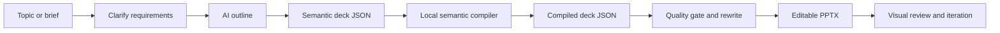
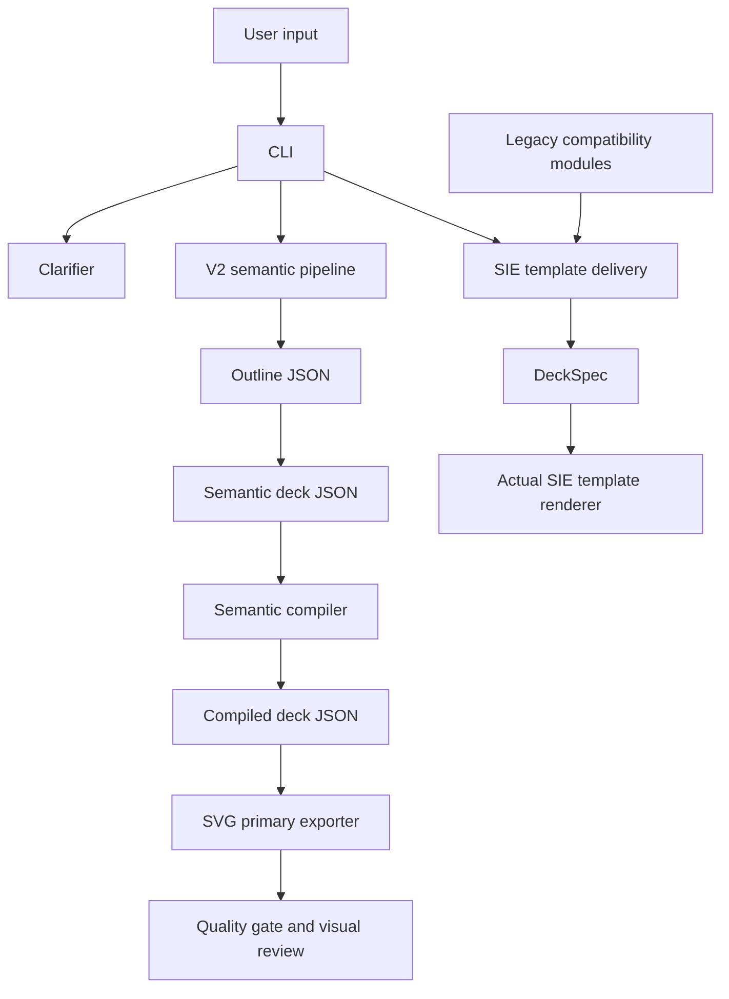
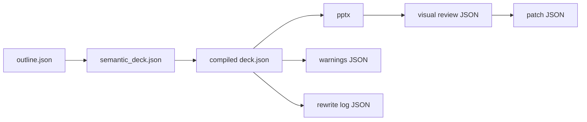

# Enterprise-AI-PPT

AI-assisted planning plus deterministic PowerPoint rendering for enterprise-grade business presentations.

- [English](#english)
- [中文](#中文)

> Diagram note: all flowcharts use default Mermaid styling without hard-coded fill colors, so they stay readable in browser light mode and dark mode.

Documentation quick links:

- `docs/CLI_REFERENCE.md`
- `docs/API_REFERENCE.md`
- `docs/PLUGIN_EXTENSIONS.md`
- `docs/COMPATIBILITY_MATRIX.md`
- `docs/RELEASE_PROCESS.md`
- `docs/BACKUP_AND_RECOVERY.md`
- `docs/ONCALL_RUNBOOK.md`
- `docs/TROUBLESHOOTING.md`

---

## English

### What This Project Does

`Enterprise-AI-PPT` turns a business topic, brief, structured outline, or existing deck JSON into editable `.pptx` files. It is built for enterprise reporting scenarios where the output must be reviewable, traceable, and editable instead of being a one-off AI image or loose text draft.

The current product direction is **V2-first**:

- AI plans the story and semantic content.
- Local compilers choose schema-safe layouts.
- SVG-primary pipeline generates editable PowerPoint files (`svg_output -> svg_final -> pptx`).
- Quality gates, content rewriting, and visual review loops help catch issues before delivery.
- Legacy/SIE template delivery remains available, but it is isolated behind compatibility boundaries.

### Best-Fit Use Cases

- Executive briefings and management reports.
- Consulting-style proposals.
- Project phase reports and roadmap decks.
- Industry research or business analysis decks.
- Customer-facing solution introductions.
- Structured material to PowerPoint conversion.

### Workflow Overview



### Architecture Overview



### Current Capabilities

- One-shot topic-to-PPT generation through the SVG-primary V2 pipeline.
- Step-by-step generation: outline, semantic deck, compiled deck, render.
- Legacy-compatible SIE template rendering through `sie-render` (non-default path).
- Single-page SIE business slide generation through `onepage`.
- Clarification flow for vague requests.
- Local deterministic layout compilation.
- Semantic layouts including `timeline`, `stats_dashboard`, `matrix_grid`, `cards_grid`, `two_columns`, `title_image`, `title_content`, `title_only`, and `section_break`.
- Manifest-backed legacy pattern variants for the SIE template path.
- Rule-based quality gate with clear hard-blocking versus soft-issue statistics.
- Content rewrite pass for fixable title, density, repetition, and structure issues.
- Visual review loop with a 9-dimension scorecard and provider injection point.
- OpenAI-compatible LLM access, including local gateway setups through `OPENAI_BASE_URL`.
- Visual review provider switch: `--vision-provider auto|openai|claude`.
- Built-in fixed consulting theme `sie_consulting_fixed` aligned with SIE red/blue-gray palette and Microsoft YaHei typography.
- Optional `svg-export` bridge command to run `ppt-master` SVG-to-PPTX conversion from this repo CLI.

### Install

```powershell
python -m venv .venv
.\.venv\Scripts\activate
python -m pip install --upgrade pip
python -m pip install -e .[dev]
```

Installed commands:

- `enterprise-ai-ppt`
- `sie-autoppt`

You can also run the project without installing the console command:

```powershell
python .\main.py --help
```

Optional lightweight Web UI (preview):

```powershell
python -m pip install -e .[ui]
python -m streamlit run .\web\streamlit_app.py
```

### Environment

For AI generation, `OPENAI_API_KEY` is optional by default.
Set it when your upstream endpoint requires direct key auth:

```powershell
$env:OPENAI_API_KEY="your-api-key"
```

If you are using a hosted coding agent or local gateway that injects auth upstream, you can run without local key and only set `OPENAI_BASE_URL` when needed.

Optional local gateway:

```powershell
$env:OPENAI_BASE_URL="http://localhost:8000/v1"
```

Private/self-hosted deployment example:

```powershell
$env:OPENAI_BASE_URL="https://llm-gateway.internal.company/v1"
$env:OPENAI_API_KEY="internal-gateway-token"
```

Useful optional variables:

- `SIE_AUTOPPT_LLM_MODEL`: default model override.
- `SIE_AUTOPPT_LLM_TIMEOUT_SEC`: request timeout.
- `SIE_AUTOPPT_LLM_REASONING_EFFORT`: reasoning effort hint for compatible providers.
- `SIE_AUTOPPT_LLM_VERBOSITY`: text verbosity hint for compatible providers.

### Quick Start

Run a no-AI smoke test:

```powershell
enterprise-ai-ppt demo
```

Generate a full V2 deck:

```powershell
enterprise-ai-ppt make `
  --topic "Enterprise AI adoption roadmap" `
  --brief "Audience: executive team. Focus on current pain points, target architecture, phased rollout, and expected value." `
  --generation-mode deep `
  --min-slides 6 `
  --max-slides 8
```

Compatibility path: render with the actual SIE template:

```powershell
enterprise-ai-ppt sie-render `
  --topic "Supply chain traceability program" `
  --brief "Customer proposal covering regulatory pressure, pain points, architecture, implementation path, and value."
```

Run visual review on an existing deck JSON:

```powershell
enterprise-ai-ppt review `
  --deck-json .\output\generated_deck.json
```

Generate HTML visual draft artifacts before PPTX delivery:

```powershell
enterprise-ai-ppt visual-draft `
  --deck-spec-json .\samples\visual_draft\why_sie_choice.deck_spec.json `
  --output-dir .\output\visual_draft `
  --output-name why_sie_choice `
  --layout-hint auto `
  --visual-rules-path .\tools\sie_autoppt\visual_default_rules.toml `
  --with-ai-review
```

Run multi-round review and patch iteration:

```powershell
enterprise-ai-ppt iterate `
  --deck-json .\output\generated_deck.json `
  --max-rounds 2
```

Export an existing SVG project through `ppt-master` converter:

```powershell
enterprise-ai-ppt svg-export `
  --svg-project-path .\projects\ppt-master\examples\demo_project_intro_ppt169_20251211 `
  --svg-stage final
```

Run strict post-processing pipeline (split notes -> finalize SVG -> export PPTX):

```powershell
enterprise-ai-ppt svg-pipeline `
  --svg-project-path .\projects\ppt-master\examples\demo_project_intro_ppt169_20251211
```

### Recommended Workflows

#### 1. One-Shot Generation

Use this when you want a fast first draft.

```powershell
enterprise-ai-ppt make `
  --topic "Manufacturing AI operations report" `
  --brief "For management review. Cover business issues, target state, rollout path, and expected benefits." `
  --generation-mode deep `
  --min-slides 6 `
  --max-slides 10
```

#### 2. Plan First, Render Later

Use this when the storyline needs review before rendering.

```powershell
enterprise-ai-ppt v2-plan `
  --topic "Data governance platform proposal" `
  --brief "Client proposal focused on current data fragmentation, governance design, roadmap, and value." `
  --plan-output .\projects\generated\data_governance.deck.json `
  --semantic-output .\projects\generated\data_governance.semantic.json
```

```powershell
enterprise-ai-ppt v2-render `
  --deck-json .\projects\generated\data_governance.deck.json `
  --ppt-output .\projects\generated\Data_Governance_Proposal.pptx
```

#### 3. Clarify Before Generation

Use this when the request is vague.

```powershell
enterprise-ai-ppt clarify `
  --topic "Help me make a PPT about internal traceability"
```

```powershell
enterprise-ai-ppt clarify-web
```

#### 4. Actual SIE Template Delivery

Use this when the output must use the real SIE PPTX template.

```powershell
enterprise-ai-ppt sie-render `
  --structure-json .\projects\generated\traceability.structure.json `
  --topic "Supply chain traceability proposal" `
  --ppt-output .\projects\generated\Traceability_SIE_Template.pptx
```

#### 5. Review And Iterate

Use this after you already have a deck JSON.

```powershell
enterprise-ai-ppt v2-review `
  --deck-json .\output\generated_deck.json
```

```powershell
enterprise-ai-ppt v2-iterate `
  --deck-json .\output\generated_deck.json `
  --max-rounds 2
```

### Main CLI Commands

| Command | Purpose | Needs AI | Main output |
|---|---|---:|---|
| `demo` | Render bundled sample deck | No | `.pptx`, logs, warning JSON |
| `make` | Default one-shot generation (`AI -> SVG -> PPTX`) | Yes | outline, semantic deck, compiled deck, `.pptx` |
| `review` | One-pass visual review alias for `v2-review` | No | review JSON, patch JSON |
| `iterate` | Multi-round review alias for `v2-iterate` | No | final review, patched deck, `.pptx` |
| `visual-draft` | Generate VisualSpec + HTML draft + screenshot + rule score (AI review optional) | No (optional) | `.visual_spec.json`, `.preview.html`, `.preview.png`, scoring JSON |
| `onepage` | Generate one SIE-style business slide | Optional | one-page `.pptx` |
| `sie-render` | Compatibility SIE template delivery path | Optional | SIE-template `.pptx`, trace JSON |
| `clarify` | Clarify vague requirements | Optional | clarifier session JSON |
| `clarify-web` | Browser UI for clarification | Optional | local web app |
| `v2-outline` | Generate outline only | Yes | outline JSON |
| `v2-plan` | Generate outline, semantic deck, compiled deck | Yes | JSON artifacts |
| `v2-compile` | Compile semantic deck to renderable deck | No | compiled deck JSON |
| `v2-render` | Render from semantic or compiled deck JSON | No | `.pptx` |
| `v2-make` | Explicit one-shot generation (`AI -> SVG -> PPTX`) | Yes | JSON artifacts and `.pptx` |
| `v2-review` | Explicit one-pass review | No | review artifacts |
| `v2-iterate` | Explicit multi-round review | No | final review and patched deck |
| `ai-check` | AI connectivity and pipeline healthcheck | Yes | healthcheck JSON |

See [docs/CLI_REFERENCE.md](./docs/CLI_REFERENCE.md) for more examples.

### Intermediate Artifacts



- `outline.json`: high-level story structure.
- `semantic_deck.json`: AI-facing semantic content contract.
- `compiled deck.json`: renderer-facing layout contract.
- `.pptx`: editable PowerPoint output.
- warning / rewrite / review / patch JSON: traceability and QA artifacts.

### Quality System

The V2 path uses two complementary quality layers:

- **Rule-based quality gate**: detects schema errors, severe overflow risks, density issues, repeated pages, weak openings/endings, quantified claims without sources, and other deterministic issues.
- **Visual review loop**: evaluates presentation quality and can request blocker-level patches.

The current visual review scorecard has 9 dimensions:

- `structure`
- `title_quality`
- `content_density`
- `layout_stability`
- `deliverability`
- `brand_consistency`
- `data_visualization`
- `info_hierarchy`
- `audience_fit`

`errors` are hard blockers. `warnings` and `high` findings are soft signals used for statistics and review context.

### V2 Themes

Themes are discovered from `tools/sie_autoppt/v2/themes/`.

Current production workflow uses a fixed theme:

- `sie_consulting_fixed` (default and enforced for `make` / `v2-*`)

Example:

```powershell
enterprise-ai-ppt make `
  --topic "Quarterly operations review" `
  --theme sie_consulting_fixed
```

### Repository Layout

| Path | Purpose |
|---|---|
| [main.py](./main.py) | Local entrypoint wrapper |
| [tools/sie_autoppt](./tools/sie_autoppt/) | Main Python package |
| [tools/sie_autoppt/v2](./tools/sie_autoppt/v2/) | V2 semantic pipeline, renderer, quality checks, visual review |
| [tools/sie_autoppt/legacy](./tools/sie_autoppt/legacy/) | Isolated legacy/SIE compatibility implementation |
| [assets/templates](./assets/templates/) | SIE template and manifest assets |
| [samples](./samples/) | Sample input and deck fixtures |
| [docs](./docs/) | Architecture, CLI, compatibility, and QA docs |
| [tests](./tests/) | Regression test suite |

### Key Documents

- [CLI Reference](./docs/CLI_REFERENCE.md)
- [Deck JSON Spec](./docs/DECK_JSON_SPEC.md)
- [PPT Workflow](./docs/PPT_WORKFLOW.md)
- [Legacy Boundary](./docs/LEGACY_BOUNDARY.md)
- [Scoring System Review Decisions](./docs/SCORING_SYSTEM_REVIEW_DECISIONS.md)
- [Token System Plan](./docs/TOKEN_SYSTEM_PLAN.md)
- [Testing](./docs/TESTING.md)
- [Compatibility](./docs/COMPATIBILITY.md)

### Development

Run tests:

```powershell
python -m pytest -q
```

Run a focused V2 test set:

```powershell
python -m pytest tests/test_v2_schema.py tests/test_v2_render.py tests/test_v2_visual_review.py -q
```

Run a healthcheck:

```powershell
enterprise-ai-ppt ai-check `
  --topic "Enterprise AI report healthcheck" `
  --with-render
```

### Current Boundaries

- Use `make`, `v2-*`, `review`, and `iterate` for the active V2 semantic path.
- Use `sie-render` or `onepage` when the actual SIE template output is required.
- Legacy HTML/template internals are retained for compatibility, but they are not the recommended user path.
- Renderer coordinates are local implementation details. AI outputs semantic content, not raw geometry.

---

## 中文

### 项目定位

`Enterprise-AI-PPT` 是面向企业汇报场景的 AI PPT 生成与交付工具。当前默认走 **V2 SVG 主链路**：`AI -> SVG -> PPTX`，目标是输出可编辑、可复核、可追溯的交付件。

### 推荐入口

- `make`: 默认一键生成（主链路）。
- `review`: 单轮视觉复核。
- `iterate`: 多轮复核与自动修复。
- `svg-pipeline`: 对已有 SVG 项目执行 `split -> finalize -> export` 严格流水线。

### 环境变量

`OPENAI_API_KEY` 默认可选。若上游要求显式鉴权再设置；若要恢复强制本地 key，可设置：

```powershell
$env:SIE_AUTOPPT_REQUIRE_API_KEY="1"
```

可选网关地址：

```powershell
$env:OPENAI_BASE_URL="http://localhost:8000/v1"
```

### 核心能力

- 语义化大纲与页面内容生成。
- 本地确定性编译与布局。
- 固定主题 `sie_consulting_fixed`（配色与字体约束）。
- 超过 6 条要点自动拆页（每页 4-6 条）。
- 视觉复核支持 `auto/openai/claude` provider 切换。
- `sie-render` 保留为兼容路径（非默认）。

### 常用命令

```powershell
python .\main.py make --topic "企业 AI 战略汇报"
python .\main.py review --deck-json .\output\generated_deck.json --vision-provider auto
python .\main.py svg-pipeline --svg-project-path .\projects\ppt-master\examples\demo_project_intro_ppt169_20251211
```

### 文档导航

- [CLI Reference](./docs/CLI_REFERENCE.md)
- [Deck JSON Spec](./docs/DECK_JSON_SPEC.md)
- [Legacy Boundary](./docs/LEGACY_BOUNDARY.md)
- [LLM Compatibility](./docs/LLM_COMPATIBILITY.md)
- [Testing](./docs/TESTING.md)
