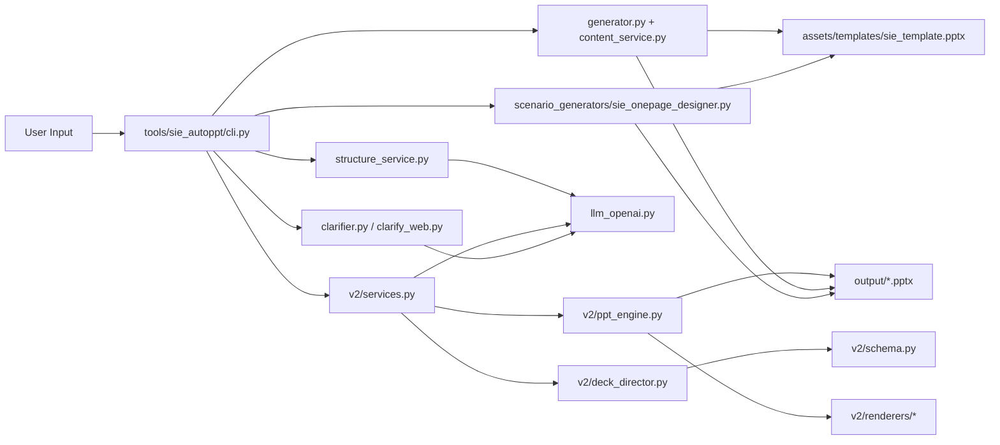

# Architecture

`Enterprise-AI-PPT` currently has two production generation paths plus several support workflows:

- `onepage`: generate a single SIE body slide with adaptive business layout selection
- `v2-*` / `make`: semantic outline-to-deck generation and PPT rendering
- `sie-render`: render real SIE template output from `StructureSpec` or `DeckSpec`
- `review` / `iterate`: render review and auto-fix loop
- `clarify` / `clarify-web`: front-end requirement clarification

This document describes the current codebase, not a future target architecture.

## System Map

## Primary Flows

### 1. One-page Flow

Used by `onepage` CLI and selected scenario generators.

1. User provides `topic` or `structure-json`
2. `structure_service.py` builds `StructureSpec` from AI or input JSON
3. `sie_onepage_designer.py` converts `StructureSpec` into `OnePageBrief`
4. The one-page engine selects a business strategy:
   - AI selection when `OPENAI_API_KEY` is available
   - heuristic fallback otherwise
5. Selected strategy maps to a layout variant such as `summary_board`, `comparison_split`, or `timeline_vertical`
6. The slide is rendered against the SIE body template and written to PPTX

Key files:

- [`tools/sie_autoppt/cli.py`](C:/Users/CHENHU/Documents/cursor/project/AI-atuo-ppt/tools/sie_autoppt/cli.py)
- [`tools/sie_autoppt/structure_service.py`](C:/Users/CHENHU/Documents/cursor/project/AI-atuo-ppt/tools/sie_autoppt/structure_service.py)
- [`tools/scenario_generators/sie_onepage_designer.py`](C:/Users/CHENHU/Documents/cursor/project/AI-atuo-ppt/tools/scenario_generators/sie_onepage_designer.py)

### 2. V2 Semantic Flow

Used by `make`, `v2-outline`, `v2-plan`, `v2-render`, and `v2-make`.

1. `v2/services.py` normalizes generation mode and slide bounds
2. In `deep` mode, context and strategy are generated first
3. AI generates an `OutlineDocument`
4. AI generates semantic deck JSON
5. `deck_director.py` compiles semantic payload into validated `DeckDocument`
6. `ppt_engine.py` and `v2/renderers/*` render the final PPTX

Key files:

- [`tools/sie_autoppt/v2/services.py`](C:/Users/CHENHU/Documents/cursor/project/AI-atuo-ppt/tools/sie_autoppt/v2/services.py)
- [`tools/sie_autoppt/v2/deck_director.py`](C:/Users/CHENHU/Documents/cursor/project/AI-atuo-ppt/tools/sie_autoppt/v2/deck_director.py)
- [`tools/sie_autoppt/v2/schema.py`](C:/Users/CHENHU/Documents/cursor/project/AI-atuo-ppt/tools/sie_autoppt/v2/schema.py)
- [`tools/sie_autoppt/v2/ppt_engine.py`](C:/Users/CHENHU/Documents/cursor/project/AI-atuo-ppt/tools/sie_autoppt/v2/ppt_engine.py)

### 3. SIE Template Render Flow

Used by `sie-render`.

1. Input arrives as `StructureSpec`, `DeckSpec`, or `topic`
2. When input is `topic`, AI first generates `StructureSpec`
3. `content_service.py` converts `StructureSpec` into `DeckSpec`
4. `generator.py` merges `DeckSpec` into the actual SIE template pool
5. A `.pptx` plus render trace JSON is written to output

Key files:

- [`tools/sie_autoppt/content_service.py`](C:/Users/CHENHU/Documents/cursor/project/AI-atuo-ppt/tools/sie_autoppt/content_service.py)
- [`tools/sie_autoppt/generator.py`](C:/Users/CHENHU/Documents/cursor/project/AI-atuo-ppt/tools/sie_autoppt/generator.py)

## Clarification Flow

Clarification is a front-door capability, not part of rendering itself.

- `clarifier.py` handles session state, requirement extraction, and clarification turns
- `clarify_web.py` exposes the same logic over HTTP
- `web/clarifier.html` is the local browser UI

This layer should run before generation when user intent is underspecified.

## Review Flow

Visual review is a closed-loop quality process:

1. Render PPT
2. Export slide previews when possible
3. Ask AI to review content and visuals
4. Generate a patch plan
5. Apply patch and optionally re-render

Key files:

- [`tools/sie_autoppt/v2/visual_review.py`](C:/Users/CHENHU/Documents/cursor/project/AI-atuo-ppt/tools/sie_autoppt/v2/visual_review.py)
- [`tools/sie_autoppt/v2/content_rewriter.py`](C:/Users/CHENHU/Documents/cursor/project/AI-atuo-ppt/tools/sie_autoppt/v2/content_rewriter.py)
- [`tools/sie_autoppt/v2/quality_checks.py`](C:/Users/CHENHU/Documents/cursor/project/AI-atuo-ppt/tools/sie_autoppt/v2/quality_checks.py)

## Boundaries

### Stable Module Boundaries

- `llm_openai.py`: all OpenAI transport and structured JSON calling
- `structure_service.py`: `topic -> StructureSpec`
- `v2/services.py`: orchestration of AI planning for semantic decks
- `deck_director.py`: semantic payload compilation and normalization
- `ppt_engine.py` / `generator.py`: PPT writing

### Intentional Legacy Areas

- [`tools/sie_autoppt/body_renderers.py`](C:/Users/CHENHU/Documents/cursor/project/AI-atuo-ppt/tools/sie_autoppt/body_renderers.py)
- [`tools/sie_autoppt/generator.py`](C:/Users/CHENHU/Documents/cursor/project/AI-atuo-ppt/tools/sie_autoppt/generator.py)

These remain active because the template-render path still depends on them. They should be treated as maintenance-heavy areas rather than preferred extension points.

## Extension Points

- Add new one-page business strategies in `sie_onepage_designer.py`
- Add new V2 layouts in `v2/renderers/*` plus schema support in `deck_director.py`
- Add new prompt behavior under `prompts/system/*.md`
- Add custom template pools in `assets/templates/`

## Current Technical Debt

- `deck_director.py` still mixes schema shaping, normalization, and routing
- V2 renderers contain many layout literals and repeated spacing logic
- Some tests still use mojibake fixtures from earlier repository states
- Legacy renderers remain in active imports for template compatibility

These are known debt items, but they are not architecture blockers.
